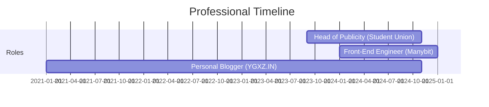

<!-- Header Banner -->
<div align="center">
  
</div>

<!-- Profile Views Counter -->
<p align="left">
  
</p>

<!-- Introduction Section -->
<h1 align="center">
  
</h1>

<!-- About Me Section -->
<div align="center">
   
  
</div>

<!-- Tech Stack -->
<h2>
  
  Tech Stack
</h2>

<div align="center">
  
  
  
  
  
  
  

</div>

<!-- Design Tools -->
<h2>
  
  Design Tools
</h2>

<div align="center">
  
  
  
  
  

</div>

<!-- Current Focus -->
<h2>
  
  Current Focus
</h2>

```typescript
const ding = {
  education: "Business Management and Information Systems @ Aberdeen-SCNU",
  role: ["Student", "Developer", "Content Creator"],
  interests: ["Internet Technology", "Digital Innovation", "Productivity Tools"],
  currentlyLearning: ["Python", "Web Development", "Business Management"],
  challenge: "Building innovative solutions that bridge technology and business"
}
```

<!-- Featured Projects -->
<h2>
  
  Featured Projects
</h2>

<div align="center">
  <a href="#">
    
  </a>
  <a href="#">
    
  </a>
</div>

<!-- Experience -->
<h2>
  
  Experience
</h2>



<!-- Connect with Me -->
<h2>
  
  Connect with Me
</h2>

<div align="center">
  <a href="https://www.ygxz.xyz" target="_blank">
    
  </a>
  <a href="mailto:bio-contact@ygxz.in">
    
  </a>
  <a href="https://jike.city/ygxz" target="_blank">
    
  </a>
  <a href="https://sspai.com/u/hh1zmte2/updates" target="_blank">
    
  </a>
</div>

<!-- Activity Graph -->
<br/>
<div align="center">
  
</div>

<!-- Footer -->
<div align="center">
  
</div>